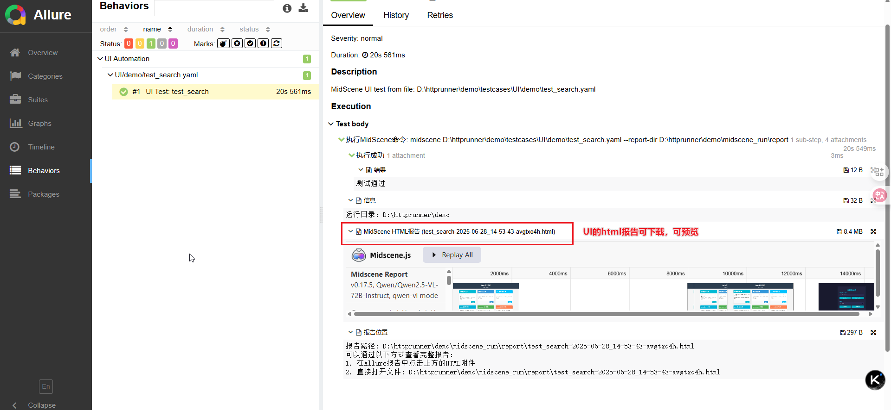
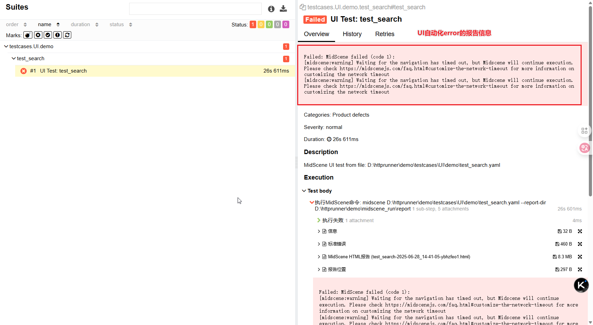

### 人生苦短，我用python。

- AI驱动的自动化。
- 配置即编程，配置即自动化。
- 简便，却不简单。
- 开源不易，纯粹！送给毕业季的朋友。

如果你在一个规模不大的公司，如果你认为python是最高效的语言，如果同时你还在积极探索AI在测试自动化的应用，
那么恭喜，你找到了一个适合你的自动化测试框架。

### 兼容接口和AI驱动UI自动化的allure统一报告预览

- 成功的UI用例

- 失败的UI用例


### 核心理念

- 简便易用；
- 约定大于配置，配置大于编程；
- 不重复造轮子，复用兼容优秀项目。（兼容httprunner和midscene）

### 项目结构

```
autopalmpay/
├── .env                    # 环境变量配置文件
├── .gitignore              # Git忽略文件配置
├── .debugtalk_gen.py       # HttpRunner生成的函数注册文件
├── debugtalk.py            # 自定义函数和钩子函数
├── pytest.ini              # Pytest配置文件
├── run_pytest.py           # 主运行脚本，生成Allure报告
├── run_scheduled.py        # 定时任务运行脚本
├── debug_pytest.py         # 调试用例运行脚本
├── run_convert.py          # HAR转换脚本
├── debug_midscene_main.py  # MidScene UI测试调试脚本
├── deploy_service.bash     # 部署服务脚本
│
├── common/                 # 公共功能模块
│   ├── get_pp_info.py      # 获取签名和设备信息
│   ├── get_token.py        # 获取C端token
│   ├── get_token_bussiness.py # 获取B端token
│   └── ms_auto_statistics.py  # 自动化统计模块
│
├── config/                 # 配置文件目录
│   ├── Bussiness_config.py # B端配置
│   ├── palmpay_config.py   # C端配置
│   ├── server_config.py    # 服务器配置
│   └── config.yml          # 通用配置
│
├── testcases/              # 测试用例目录
│   ├── conftest.py         # Pytest配置和钩子函数
│   ├── api/                # API测试用例
│   │   └── pp_app/         # pp_app相关API测试
│   │       ├── airtime/    # airtime相关API
│   └── UI/                 # UI测试用例
│       └── demo/           # UI测试示例
│
├── util/                   # 工具类
│   ├── case_util.py        # 用例处理工具
│   ├── ding_util.py        # 钉钉消息工具
│   ├── file_util.py        # 文件处理工具
│   ├── path_util.py        # 路径处理工具
│   ├── sftp_util.py        # SFTP上传工具
│   ├── time_util.py        # 时间处理工具
│   └── yaml_util.py        # YAML配置处理工具
│
├── allure_result/          # Allure测试结果目录
├── allure_report/          # Allure报告目录
└── midscene_run/           # MidScene运行目录
    └── report/             # MidScene报告目录
```

### 执行命令

进入项目根目录下执行命令，完全兼容pytest的语法：

- 运行所有用例：

```python
python - m pytest .\testcases
```

- 运行接口用例

```python
python - m pytest .\testcases\api
```

- 运行UI用例

```python
python - m pytest .\testcases\UI
```